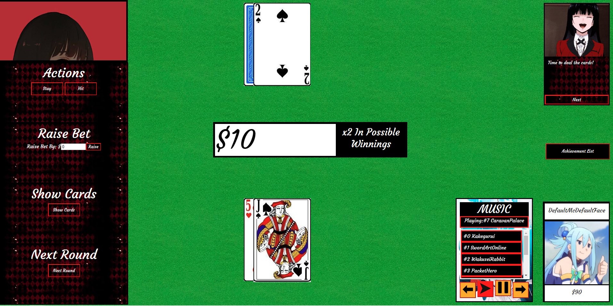

# Blackjack Game

This project is an interactive Blackjack game built with HTML, CSS, JavaScript, and jQuery. It offers a smooth and engaging gameplay experience with stylish visuals and animations. The game is fully responsive, making it enjoyable to play on both desktop and mobile devices.

## Features

- **Interactive Gameplay:** Engage in a classic game of Blackjack with hit, stand, and double-down options.
- **Smooth Animations:** Enjoy sleek animations for card dealing and game actions.
- **Stylish UI:** A visually appealing interface with responsive design for a seamless experience on all devices.
- **Scoring System:** Keep track of wins, losses, and ties with real-time score updates.
- **Responsive Design:** Play the game on any device—whether desktop, tablet, or mobile—with an optimized experience.

## Tech Stack

- **Frontend**: JavaScript, jQuery
- **Markup/Style**: HTML/CSS

## Prerequisites

- A modern web browser (Chrome, Firefox, Safari, etc.)
- Clone the repository and open the `index.html` file in your browser.

### How to Play

1. Open `index.html` in your browser to access the homepage.
2. Click "Play Blackjack Game" to begin.
3. Use the controls to hit, stand, or double down and see if you can beat the dealer.
4. Good luck!

### Game Preview

Enjoy your game of Blackjack and have fun!
